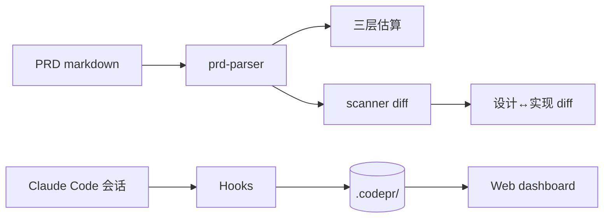

# v0.1 — 基础雏形

## 背景

把 codePR 从空仓库做到可用 MVP。差异化于现有 ccusage 系工具的核心抓手：
1. 事前估算（三层结合：规则 + 历史 KNN + AI 区间）
2. 设计↔实现 diff（PRD 用 frontmatter 声明组件，scanner 检测真实代码缺口）

## 架构

## 验收标准

- [x] 插件清单 + 6 个 slash commands + 4 个 hooks
- [x] 三层估算引擎（规则 / 历史 / AI）跑通端到端
- [x] Scanner 覆盖 7+ 框架（express / nest / spring / flask / django / rails / fastify）
- [x] 设计↔实现 diff 能输出 matched / missing / deviation
- [x] Web dashboard 基础版（Design Doc / Reality / Estimate / History 四个 tab）
- [x] Statusline 输出 active req 进度
- [x] Hooks 全 fail-safe，异常不阻塞会话
