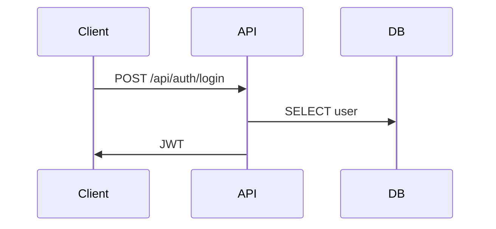

# 用户登录

## 背景
让用户可以通过邮箱+密码登录，签发 JWT。

## 架构

```mermaid
sequenceDiagram
  Client->>API: POST /api/auth/login
  API->>DB: SELECT user
  API->>Client: JWT
```

## 验收标准
- [ ] 登录成功返回 JWT
- [ ] 密码错误返回 401
- [ ] Session 持久化到 DB
- [ ] 提供 logout 接口
