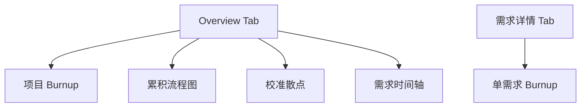

# v0.2 — 图表套件

## 背景

针对 AI 驱动开发的特点（scope 自然增长、token 是核心货币、不按 sprint 跑），做一套区分于竞品的图表。关键洞察：纯 burndown 会骗人 —— audit 揪出新缺失时曲线只是变平，看不见 scope 上涨；burnup 用双线让 scope 增长显式可见。

## 5 张图表清单

## 验收标准

- [x] 时间序列聚合层（events.jsonl → 时间点数据）
- [x] 5 个 API endpoints `/api/charts/*` 全部返回正确数据
- [x] Chart.js + Luxon adapter 集成（CDN，不引构建工具）
- [x] 项目 Burnup：scope 阶梯线 + 实际平滑线 + 估算阴影带
- [x] 单需求 Burnup：实际超估算上界时变红 + 三层估算虚线可切换
- [x] 校准散点：±50% 容差带 + y=x 完美对角线 + 命中/超出红绿区分
- [x] CFD：Done/InProgress/Backlog 堆叠面积 + WIP 警告
- [x] Gantt-lite：实际工期条 + 估算上界半透明背景条
- [x] Overview 布局：5 统计卡 + burnup 全宽 + CFD/calibration 双栏 + Gantt 全宽
- [x] `seed-demo` 命令一键生成可视化数据
