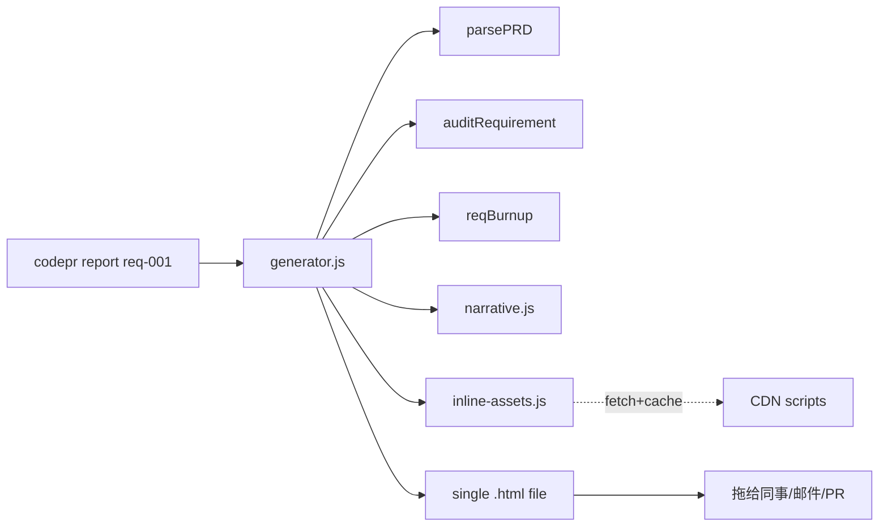

# v0.3 — 自包含 HTML 报告

## 背景

Dashboard 是给"正在开发的人"看的实时驾驶舱，HTML 报告是给"非作者人类一周后回看 / PM / PR reviewer"看的可分享叙事产物。两者职责互补。

用户两次强调 **图文结合的 HTML 是核心人类接触面**，因此 v0.3 把它作为重点（非可选附加项）。

## 关键约束：自包含

## 验收标准

- [x] 单需求报告 7 个 section：头部 / AI 叙事 / PRD 富渲染 / 设计↔实现对照 / Burnup 图 / 代码片段 / 元信息
- [x] **零外部依赖** —— Chart.js / Luxon / Mermaid runtime 全部 inline（base64 内嵌）
- [x] 单文件 3.76 MB，离线可用，可拖到陌生机器打开
- [x] AI 叙事 3 段（当前状态 / 差距 / 建议），按内容 hash 缓存
- [x] 无 ANTHROPIC_API_KEY 时启发式降级
- [x] 资产缓存 7 天 TTL（第二次生成 188ms）
- [x] 极简 Markdown 渲染器（零依赖，覆盖 PRD 用到的所有语法）
- [x] 代码片段抽取 + 简易语法高亮（keyword / string / comment / function）
