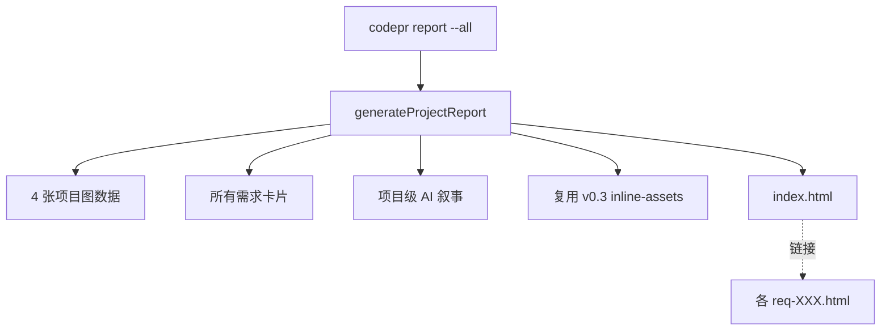

# v0.4 — 项目级 HTML 报告

## 背景

v0.3 完成单需求级自包含 HTML 报告后，v0.4 第一步是项目级总览报告：把所有需求 + 4 张项目图整合到一张 `index.html`，让 PM / 同事一眼看到全局。

## 架构复用

复用 v0.3 资产缓存 → 多份报告共享同一份 mermaid/chart.js/luxon，体积不翻倍。

## 验收标准

- [x] 6 个 section：头部 + AI 叙事 + Burnup + CFD/Calibration 双栏 + Gantt + 需求卡片网格
- [x] AI 叙事字段：`overview / risks / next_steps`
- [x] 项目级缓存 key = `project-<hash>`
- [x] 4 张图全部从 `window.__CODEPR_DATA__` inline 数据渲染
- [x] 需求卡片含进度条 + 4 块统计 + PRD 摘要 + 链接到 single-req 报告
- [x] 实测：单文件 3.8 MB / 零外部依赖 / 第二次 171ms
- [ ] dogfood：用 codePR 自己的开发历程作为示例数据
