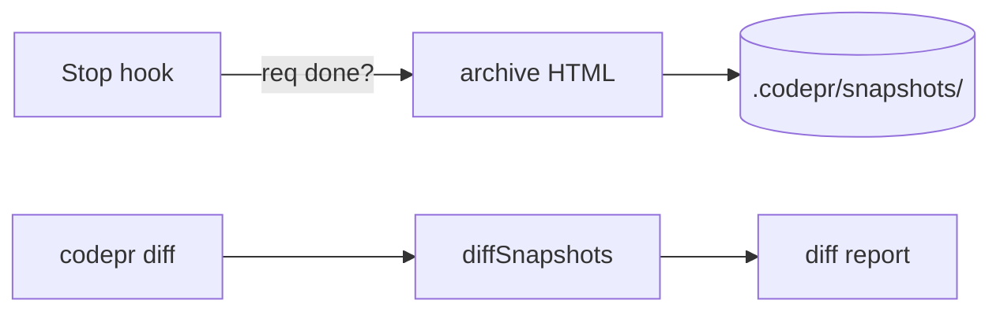

# v0.4 — 历史快照 + 快照 diff

## 背景

需求完成后 / 每周快照一次项目报告，归档到 `.codepr/snapshots/<ts>.html`。用户可以做"时间旅行"看一周前的项目状态，也可以让两份快照 diff 看进展。

## 架构

## 验收标准

- [ ] Stop hook 检测到 req 完成时，触发 `generateProjectReport()` 写到 `.codepr/snapshots/<ISO>.html`
- [ ] 每周（用 cron 或 git hook）自动快照一次（即使无 req 完成）
- [ ] `codepr diff <ts1> <ts2>` 输出两份快照之间的变化
- [ ] Diff 内容：哪些 req 状态变了、哪些 token 多消耗了、哪些组件落地了、估算准确率变化
- [ ] 输出 HTML 含"双向对比"视图（左右并排关键指标）
