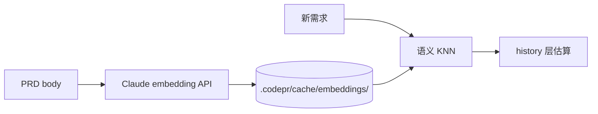

# v0.4 — 估算校准强化

## 背景

当前 v0.1 的历史校准用的是简单 Jaccard：tag 集合交并 + 文本词袋交并。问题：

- 标签拼写差异（"auth" vs "authentication"）找不到相似
- 同义词找不到（"登录" vs "鉴权"）
- 文本词袋忽视语义相邻性

升级用 Claude embeddings 或本地小模型生成 PRD 向量，余弦相似度替换 Jaccard。

## 架构

## 验收标准

- [ ] `src/estimator/embeddings.js` — embedding 调用 + 缓存
- [ ] embedding 缓存到 `.codepr/cache/embeddings/<id>.json`
- [ ] history.js 的 `similarity()` 用 cosine 替换 Jaccard
- [ ] 冷启动逻辑保持（< 3 条历史时跳过这层）
- [ ] 无 API key 时降级回 Jaccard
- [ ] 回归测试：原有 demo 数据的校准命中率不下降
